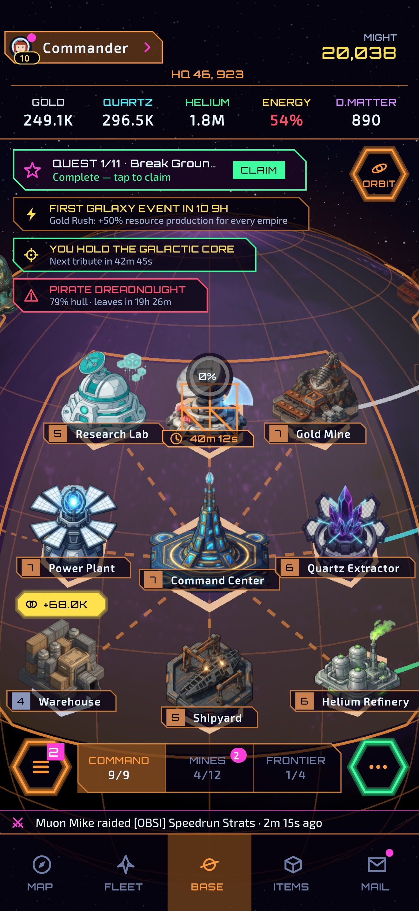
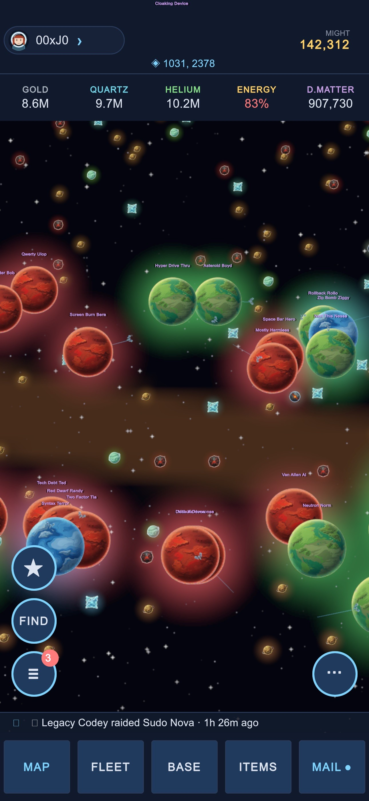
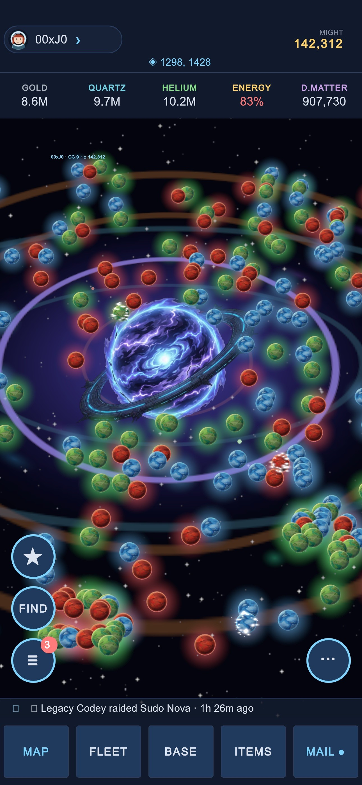
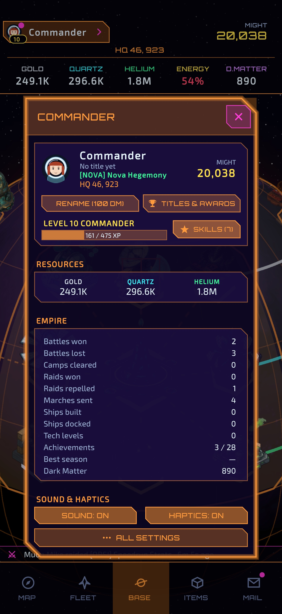
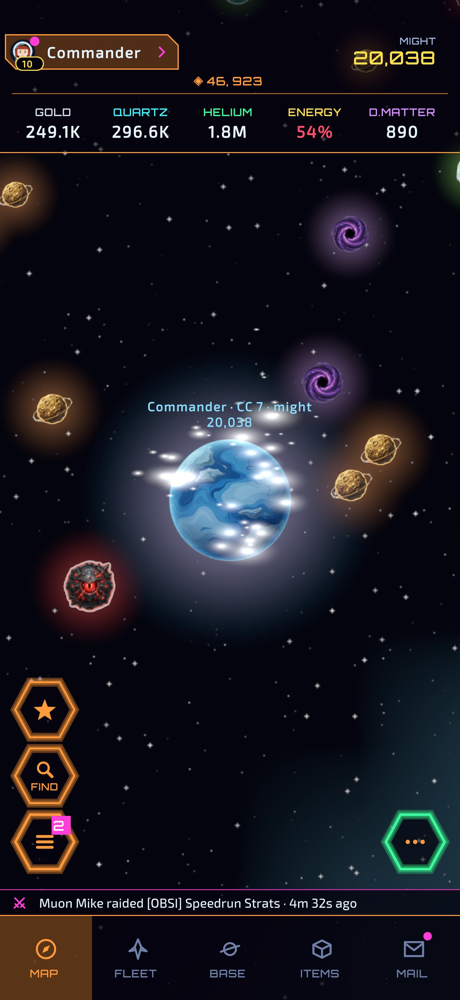
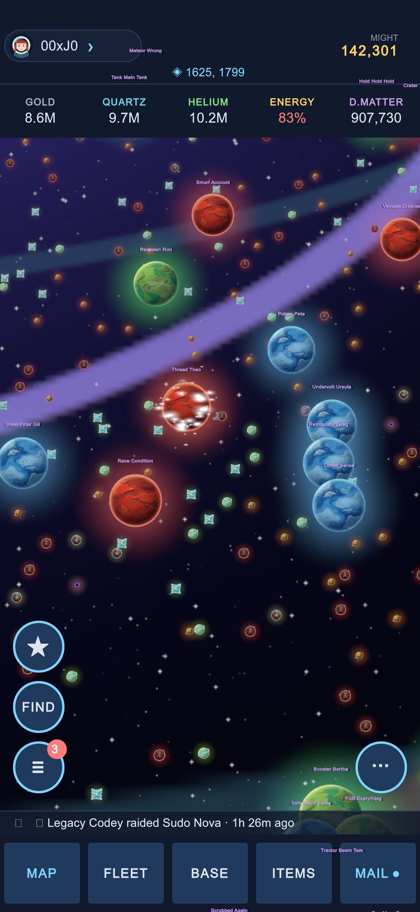

# Novacore — A Galaxy Royale

*Novacore was the project's original name; Galaxy Royale is what it became.
Both are kept here on purpose — the rename is part of the story.*

**A research / exploratory project: could I take a mobile 4X space-strategy game
from blank folder → running on my own iPhone — designing, building, and
re-designing it conversationally with an AI coding assistant?**

The answer turned out to be yes, three times over. This repo is the final
form — **Galaxy Royale**, a single-player game that *simulates* a live MMO
server: you against **249 AI commanders** who play by the same rules you do,
in one persistent 2500×2500-tile galaxy that keeps living while you sleep.
(The earlier incarnations — a TypeScript web prototype and a full
online-multiplayer Unity build — are told in the history section below; their
code stayed home.)

> ⚠️ **This is an experiment, not a product.** It was built to answer "can this
> be done and what does it feel like," not to ship on an app store. Balance is
> in flux, NEW GAME offers a developer TESTING economy next to the honest
> STANDARD start, and rough edges are part of the artifact. Read it like a lab
> notebook with a playable result. (`store/` holds the drafts for taking it to
> the App Store anyway.)

---

## Screenshots

Running on an iPhone — the base view, the living galaxy of 249 rivals, and
the supernova at its heart:

| Your planet | The galaxy | The core |
|---|---|---|
|  |  |  |
|  |  |  |

## The game

Portrait-mode mobile 4X, built in **Unity 6** (URP + UI Toolkit, pure-C# UI):

- **You vs 249 simulated commanders.** Every rival is a *full simulated
  empire* — same buildings, cost curves, 26-tech research tree, 23-hull fleet
  triangle, and combat resolver as the player. Each has a deterministic
  personality (aggression, economy focus, activity hours) and "joined the
  server" up to three days before you did.
- **A true free-for-all.** Everyone hunts the richest unshielded loot —
  including you. Raiders estimate whether they can actually *win* before
  committing, bring haulers when the haul is big, hold grudges, scout rich
  targets with spy probes, and relocate across the galaxy to hunt marks.
  Keeping a garrison home is a real deterrent; hoarding unprotected resources
  paints a target on your back.
- **The world never sleeps.** Close the app for 8 hours and the entire galaxy
  fast-forwards through the same simulation: rivals build, research, gather,
  and raid each other — and you. You wake up to battle reports, radar scan
  alerts, and planets still **burning on the map** from last night's wars
  (a 4-hour live particle-fire scar on any planet that lost a defense).
- **Galaxy News.** A ticker carries every battle in the galaxy; the full wire
  includes a MOST WANTED board of the busiest raiders — scout your next target
  from the headlines.
- **Real counterplay.** Raids resolve at *arrival* against live defenses, so
  the Radar Station's early warning is a genuine dodge window; an activatable
  Aegis Shield bubble deflects inbound fleets but drops the moment you raid
  anyone (attack or turtle — not both).
- **No accounts, no server.** Everything saves to the device — atomic writes
  with a rolling backup file.
- **Beyond the app.** A home-screen widget shows your next timers, and a Live
  Activity counts down an incoming raid on the Lock Screen and in the Dynamic
  Island (a WidgetKit extension in `GalaxyRoyale/iOSWidget/`, added to the Xcode
  project by the build).

## Why it's built the way it is

The interesting engineering lives in a few decisions:

- **Deterministic, engine-free simulation.** The entire game sim
  (`GalaxyRoyale/Assets/Scripts/Sim/`) never references `UnityEngine` —
  enforced at the assembly level. One tick = one second, integer math,
  map derived from a seed. That's why offline catch-up is exact, saves are
  small JSON, and the whole thing is unit-testable (79 EditMode tests,
  including performance tripwires).
- **The "fake MMO" architecture.** The game began as a real client-server
  MMO. When it pivoted to single-player, the multiplayer *shapes* survived:
  bots publish the same defense snapshots, fly the same marches, and trigger
  the same radar warnings the real network layer once did — the wire protocol
  just became function calls. The 249 bots advance in coarse "think steps"
  (closed-form economy between decisions), so simulating the full galaxy
  costs ~half a second at boot and ~one int-compare per frame.
- **Procedural-first art.** Planets are generated from equirectangular
  texture blends with per-seed hue jitter; map markers, flames, and shields
  are runtime-built sprites and particle systems. Real PNGs can be dropped
  into `Resources/` folders to replace any of it, zero code changes.
- **AI-assisted development as the method.** Nearly all design and code in
  this repo was produced in iterative sessions with an AI assistant (Claude),
  steered by playtests on a real device: describe a mechanic → build it →
  run the tests → play it on the phone → feed the feel back in. The code
  comments still carry that voice — many read like design-decision notes
  ("user spec", playtest feedback, the reasoning behind a constant) because
  that's literally what they were.

## Running it yourself

**In the Unity editor (quickest):**
1. Install [Unity Hub](https://unity.com/download) + Unity `6000.5.2f1`
   (with iOS Build Support if you want device builds).
2. Hub → *Add project from disk* → the **`GalaxyRoyale/`** subfolder.
3. Open, let it import, press ▶. Title screen → NEW GAME → you're in.

**On an iPhone:**
1. In Unity: menu `GalaxyRoyale → Build iOS (Xcode project)` — outputs
   `GalaxyRoyale/Builds/iOS/Unity-iPhone.xcodeproj`.
2. **Set your signing first**: `Assets/Editor/BuildScript.cs` ships a
   placeholder bundle id (`com.example.galaxyroyale`) and an empty team. Put
   in your own reverse-domain identifier, then pick your Apple Developer team
   in Xcode after opening the generated project.
3. Open in Xcode, select your device, Run.

**Tests without Unity:** the simulation never touches UnityEngine, so CI
(`.github/workflows/sim-tests.yml`) builds it with the plain .NET SDK and runs
the EditMode suite on every push and pull request — `dotnet test ci/Tests`
does the same locally. (The iCloud backup tests need Unity and stay in the
editor run.)

**TestFlight / the App Store:** `scripts/testflight.sh` builds, archives and
exports a signed `.ipa` (`--upload` sends it to App Store Connect).
`store/README.md` is the checklist, with drafts of the listing, privacy
answers and review notes. `scripts/screenshots.sh` takes the App Store
screenshots in the Simulator.

**Tuning the galaxy:** every pacing knob — bot count, aggression, raid
cooldowns, punch-up limits, burn duration — is a named constant on
`BotSystem` (`GalaxyRoyale/Assets/Scripts/Sim/Bots/Bots.cs`) or in
`Balance.cs`. The difficulty (NEW GAME, or the profile) scales how hard the
rivals lean on you (`Data/Difficulty.cs`).

## Repo map

```
GalaxyRoyale/        — the Unity 6 project (open THIS folder in Unity Hub)
  Assets/Scripts/
    Data/            — all game data + balance constants (pure C#)
    Sim/             — the deterministic simulation (no UnityEngine)
      Bots/          — the simulated galaxy: 249 AI commanders
    Local/           — on-device saves (atomic + rolling backup)
    Game/ + UI/      — Unity bridge, views, pure-C# UI Toolkit interface
    Tests/           — EditMode NUnit suite (sim, codec, bots, perf)
  Assets/Editor/     — batch iOS build + art-processing tools
  Assets/Resources/  — runtime-loaded art (drop-in replaceable)
ci/                  — .NET projects that build Data + Sim + the tests without Unity (CI)
.github/workflows/   — sim-tests.yml: the suite on every push and pull request
scripts/             — testflight.sh (signed .ipa, optional upload), screenshots.sh
store/               — App Store listing, privacy and review-notes drafts + checklist
README.md            — you are here
UNITY_SETUP.md       — editor/build settings cheatsheet
```

## The history story

This game was built three times, each version answering a different question.

**Round one — can the simulation work at all?** *iGalaxy v1*, a TypeScript +
Phaser 3 web prototype (~15K lines, 101 tests), proved the core design in a
browser: a deterministic tick-based economy, a seeded 2500×2500 galaxy, fleets,
combat, and offline catch-up — wrapped in a WKWebView shell just to feel it on
a phone.

**Round two — can it be a real online game?** *Novacore* rewrote everything in
Unity 6 and used **Supabase as the research bed for online and database
capabilities**: user account creation and management, authenticated cloud
saves, shared player positions in one galaxy, friends, alliances with
timer-help, global chat, and async PvP raids with radar early-warning — all
exercised on a physical iPhone through dozens of playtest cycles. It worked.
It also made the costs of running a real server for an experiment obvious.

**Round three — what if the server was simulated?** The final pivot kept every
system the online game had built and pointed all of it inward: the "other
players" became 249 fully simulated commanders with personalities, the network
layer's defense snapshots and radar contacts became function calls, and the
result is a single-player game that *feels* like logging into a live server —
rankings shift overnight, planets burn from wars you slept through, and
somebody named Plasma Karen is coming for your gold. That's the game in this
repo.

## Status & honesty notes

- `Balance.TestMode = true` — you start rich (1M premium currency, 500K
  resources). Deliberate, for exploration; flip it off in `Balance.cs`.
- Fully offline — no accounts, no server, no analytics. Saves live on-device.
- Tested on iPhone (iOS 13+ target) and in-editor on macOS. Android compiles
  from the same project but was never a focus.
- No license has been chosen yet — if you want to build on this, open an
  issue/ask first.
